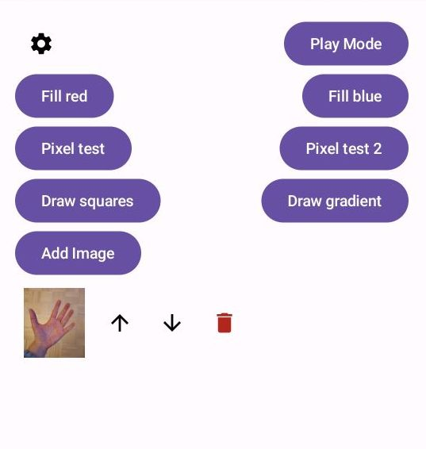
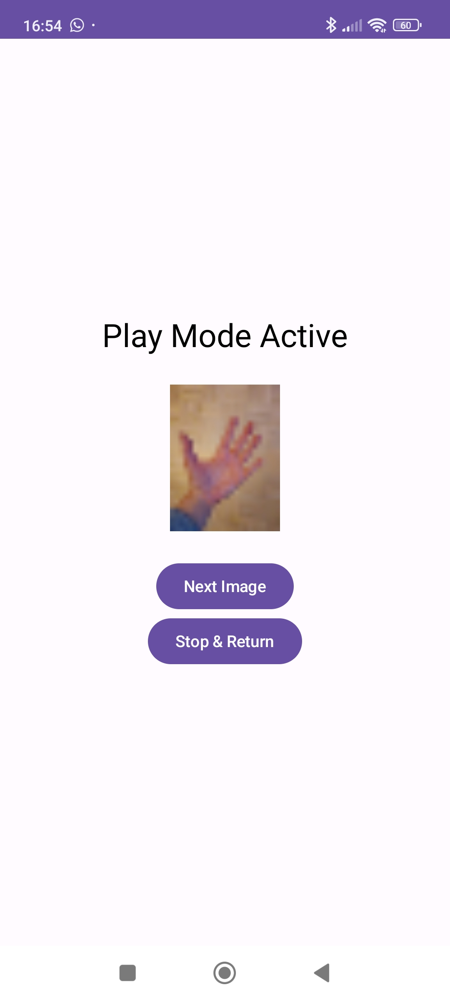
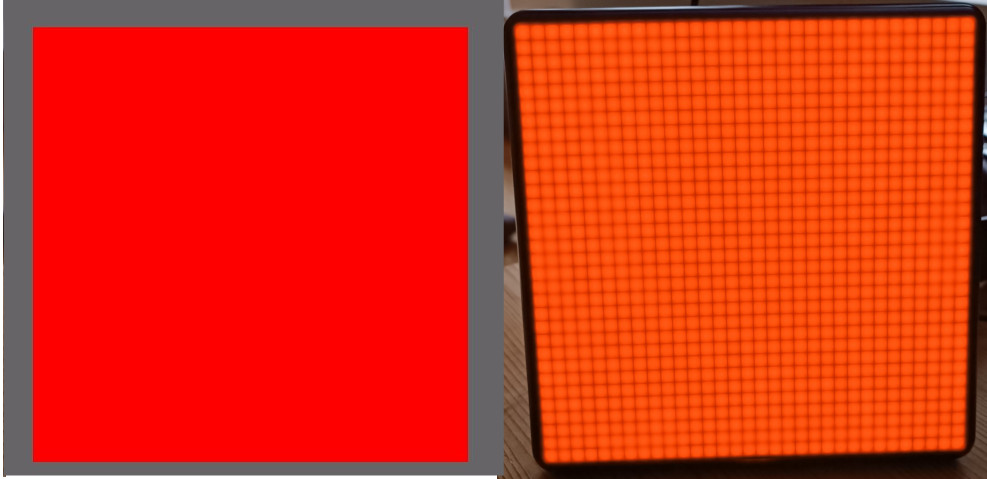
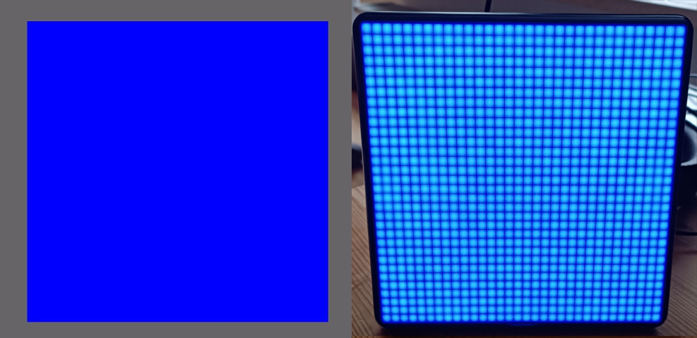
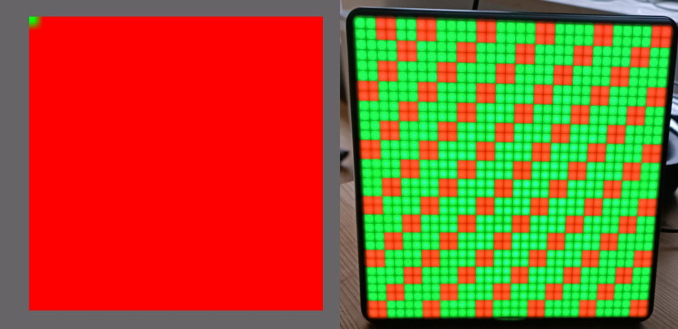
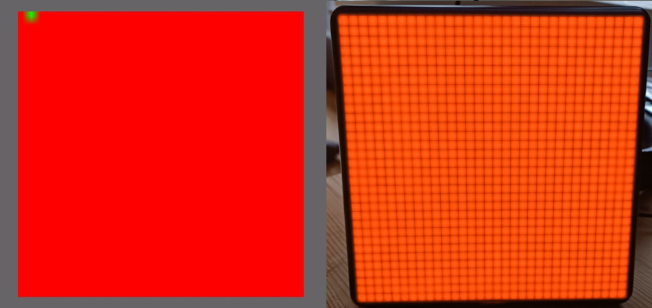
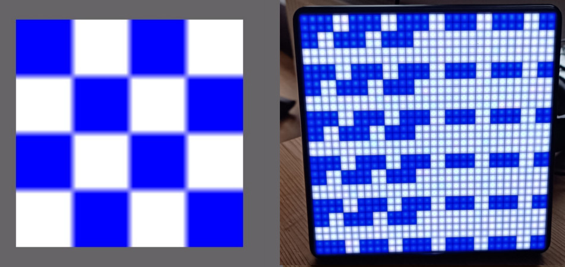
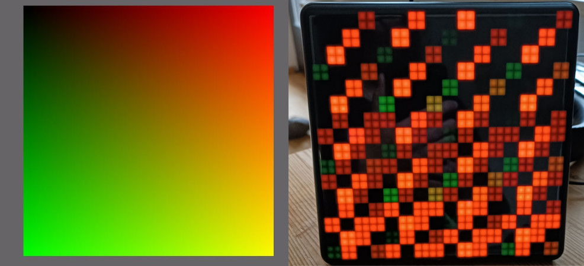

# Pixoo Max App

> **NOTE**: This is a work in progress! It is currently not yet working.

## Aim

This repository contains the code to run an Android 13 app on a mobile phone 
and connect it to a Divoom Pixoo Max display via Bluetooth. It is written
in Kotlin.

The app is supposed to let the user select images from their phone
and send them to the Pixoo Max display. The next image in the sequence is only
shown when a "Next" button is clicked on the app. 

This behavior differs from the
official Divoom app for the Pixoo Max in that the official app only
lets the user configure the time for which an image is shown. After that,
the app automatically sends the next image in the sequence.

## Why another Pixoo Max repository

While there are already several repositories with code to connect to a Pixoo Max,
I was unable to find one that I could integrate into an Android app. 
Therefore, I had to write my own.

Moreover, all repositories I could find use the so called palette mode of the
Pixoo Max. This means that in the data structure sent to the Pixoo Max,
the first bytes encode the color palette that is used in the image.
The remaining bytes then encode the actual image by referncing the
color values from the palette. This is effectively a data compression, especially
if few colors are used.

Unlike these repositories, my code tries to send the images as "raw" RGB values
where the bytes encode the actual RGB values. So it may be of interest to anyone
that tries to reverse engineer the protocol for the Pixoo Max.

This is what the app looks like (after a Pixoo max to connect to was selected):

And this is what it looks like once the "Play" button was clicked:

## Prerequisites

To use the app, ensure that these prerequisites are met:

- Pixoo Max Display is turned on
- Mobile phone has bluetooth enabled
- Pixoo max display and mobile phone are paired via bluetooth
- When the app starts for the first time, it needs to be given the permission to use bluetooth

## Package structure

To send a single image with the `0x44` command via Bluetooth, 
the packages are constructed as follows:

| Value | Bytes     | Description                                                                                                                                   | Escaped`*` |
|-------|-----------|-----------------------------------------------------------------------------------------------------------------------------------------------|------------|
| 0x01  | 1         | Package start flag                                                                                                                            | No         |
| 0x0E  | 1         | Byte length of command + unescaped Payload + the Length itself = 3086, LSB                                                                    | Yes        |
| 0x0C  | 1         | Length (3086), MSB                                                                                                                            | Yes        |
| 0x44  | 1         | Command to draw a single image                                                                                                                | Yes        |
| 0x00  | 1         | ???                                                                                                                                           | Yes        |
| 0x00  | 1         | ???                                                                                                                                           | Yes        |
| 0x00  | 1         | ???                                                                                                                                           | Yes        |
| 0x20  | 1         | Image width in pixels (32); Little Endian; LSB                                                                                                | Yes        |
| 0x00  | 1         | Image width in pixels (0); Little Endian; MSB                                                                                                 | Yes        |
| 0x20  | 1         | Image height in pixels (32); Little Endian; LSB                                                                                               | Yes        |
| 0x00  | 1         | Image height in pixels (0); Little Endian; MSB                                                                                                | Yes        |
| 0x00  | 1         | Padding                                                                                                                                       | Yes        |
| 0x00  | 1         | Padding                                                                                                                                       | Yes        |
| 0x00  | 1         | Padding                                                                                                                                       | Yes        |
| 0x00  | 1         | Padding                                                                                                                                       | Yes        |
|       | `32*32*3` | Actual image data encoded as RGB888, i.e. 3 bytes per pixel (RGB) read row wise from left to right, top to bottom                             | Yes        |
|       | 2         | Checksum, Little Endian, as the sum of the (unescaped) length, (unescaped) command, and (unescaped) image data (including the 11 byte prefix) | Yes        |
| 0x02  | 1         | Package end flag                                                                                                                              | No         |

`*` Any byte value of `0x01, 0x02, 0x03` is escaped by adding
`0x03` as the escapee character followed by `0x04` (for `0x01`),
`0x05` (for `0x02`), or `0x06` (for `0x03`).

## Current state

The overall package structure seems to be correct, e.g. the checksum calculation.
I base this on the fact that variants of the code were rejected by my Pixoo
Max and the code matches the descriptions I found of the protocol (see references).

But the app does not yet work. In order to debug it,
I added several buttons that allow to display specific test patterns.

While the colors for all my test patterns seem to be shown correctly, the
pixel positions are off. Moreover, the "pixel size" seems to be 2x2 instead
of 1x1. 

Here is a list of all buttons with the patterns they should show (left) 
and what the Pixoo Max actually shows (right).

### Fill red

### Fill blue

### Pixel test

### Pixel test 2

### Draw squares

### Draw gradient

## References

These two pages were extremely helpful in determining the overall package
structure when sending images to the Pixoo Max (0x44 command).

- [Protocol description](https://docin.divoom-gz.com/web/#/5/146)
- [0x44 command](https://docin.divoom-gz.com/web/#/5/289)